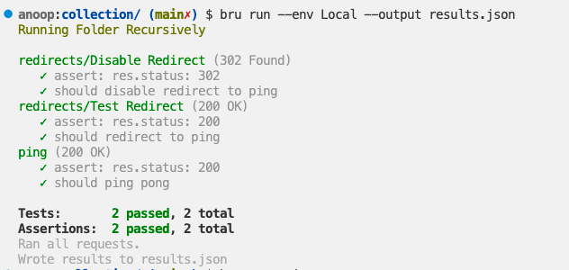

# bruno-testbench

A simple expressjs server that I use to test bruno.

### Start Server
This will start the server on port 6000
```bash
# install node dependencies
npm install

# start server
npm start
```

### Collection
The bruno collection is located in the `collection` directory.
You can open it in Bruno.

### Run Bru CLI on Collection
```bash
cd collection
bru run --env Local
```



### License
[MIT](LICENSE)